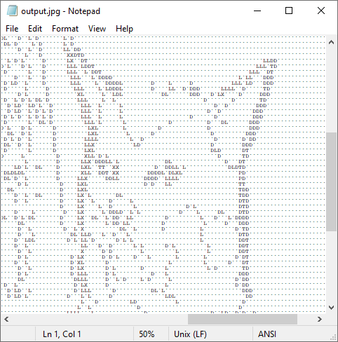
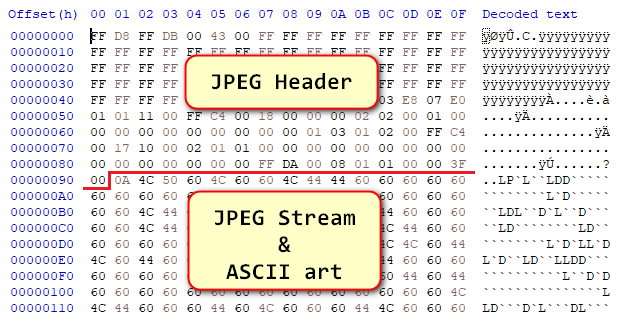

# jpgtxt

jpgtxt is just-for-fun utility for generating jpg files that can be viewed both in image viewer and text editor (as ASCII art).

## Example

Input file:


Output jpg-file:


Output jpg-file opened in Notepad (fragment):



Output jpg-file opened in hex-editor



## Usage

```bash
python jpgtxt.py <input file> <output file>
```
